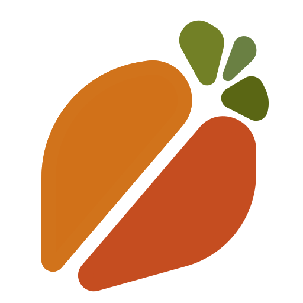

# Kaki

  
  

?> Kaki is currently not released. Once version `0.1.0` is published, the
language will be available for use.

The _Diospyros kaki_ is the Japanese persimmon - a deciduous tree that offers
sweet yet tangy fruits. If the persimmon (sometimes called kaki) is your
favorite fruit, it can now be your favorite programming language too! (Though
it can still be your favorite language if even if you don't like the fruit.)

Fruity business aside, Kaki is a functional-first, concurrent, and lightweight
programming language.

To get started, take a look at the [tutorial](tutorial/introduction.md).
